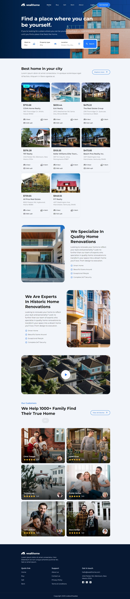

# WEALTHOME

## DESCRIPTION

This is a realestate website devloped by codewithsadee (link below)

## What did I Use

- HTML5
- CSS3
- javascript
- Mobile first workflow
- Responsive markup
- google icons
- google fonts

## What did I learn

This project has helped me with understanding proper html markup, page structure and writing high standard css stylesheets.

## LIVE SITE URL

Visit the live site[Site url](https://zeinghra.github.io/lg-project-walthome/)

## ME 👋

My X Account [Click here](https://twitter.com/Zein_ghra)

My github Account [Click here](https://github.com/zeinghra)

## Author

This project was made with the help of this amazing YouTuber [codewithdsadee](https://youtu.be/bKjpNrbMyvc?si=6Lt7w5ex4PnyCBik)

## Screenshot

